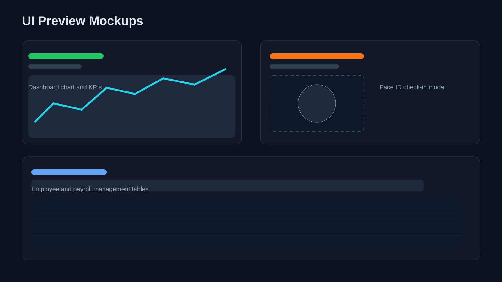

<p align="center">
  
</p>

# ITGlobal - Chấm Công & Quản Trị Nhân Sự (Frontend)

Frontend cho hệ thống chấm công nhân sự, tối ưu cho trải nghiệm quản lý và vận hành thực tế.

## 1. Tổng quan sản phẩm
- Mục tiêu: Tạo giao diện rõ ràng, dễ dùng cho nhân viên và nhà quản lý.
- Định hướng UX: Nhanh, trực quan, responsive trên desktop và mobile.
- Giá trị cho doanh nghiệp:
- Theo dõi dữ liệu chấm công theo thời gian thực.
- Đơn giản hóa quy trình nghỉ phép, tăng ca, xem lương.
- Giảm sai sót nhập liệu và thao tác thủ công.

## 2. Điểm nổi bật giao diện
- Tách vai trò rõ ràng: `Admin` và `Employee`.
- Dashboard thống kê trực quan với biểu đồ và KPI.
- Tích hợp chấm công/nhận diện khuôn mặt và đăng nhập token.
- Hệ thống bảng dữ liệu có bộ lọc, tìm kiếm, cập nhật nhanh.
- Form nghiệp vụ dùng `react-hook-form` + validation.

## 3. Công nghệ sử dụng
- Framework: Next.js 14 (App Router)
- Ngôn ngữ: TypeScript / JavaScript
- UI: Ant Design + Tailwind CSS
- Data & API: Axios
- Chart: Recharts
- Tiện ích: Dayjs, Framer Motion, React Webcam

## 4. Các màn hình chính
### Khu vực Admin
- Dashboard, Nhân viên, Phòng ban, Ca làm việc
- Chấm công, Nghỉ phép, Làm thêm, Lương
- Báo cáo và Profile quản trị

### Khu vực Employee
- Home, Tài khoản
- Đăng ký khuôn mặt
- Lịch sử chấm công
- Tạo và theo dõi đơn Nghỉ phép / Làm thêm

## 5. Cài đặt và chạy local
### Yêu cầu
- Node.js 18+
- npm 9+

### Cài dependencies
```bash
npm install
```

## Biến môi trường (.env.local)
Tạo file `.env.local` ở thư mục gốc của frontend và cấu hình các biến sau:

```env
NEXT_PUBLIC_API_URL=http://localhost:3000
NEXT_PUBLIC_ENV=development
NEXT_PUBLIC_USE_LAN=false
```

## 🏃‍♂️ 6. Chạy dự án
```bash
# Chế độ Development (Dùng khi đang code)
npm run dev

# Đóng gói dự án (Build để chuẩn bị deploy)
npm run build

# Chế độ Production (Chạy bản đã build ở local)
npm run start
```

Lưu ý: Mặc định Frontend sẽ khởi chạy tại `http://localhost:3001`.

## 🔗 7. Lưu ý kết nối Backend
- Đảm bảo Backend đã bật CORS để cho phép tên miền của Frontend gọi API.
- Biến `NEXT_PUBLIC_API_URL` phải trỏ đúng vào địa chỉ URL mà Backend đang chạy (VD: `http://localhost:3000`).
- Khuyến nghị: Nên khởi động Backend trước khi chạy Frontend để có thể demo đầy đủ luồng nghiệp vụ không bị gián đoạn.

## 💼 8. Định hướng demo (Cho Recruiter)
Để buổi phỏng vấn diễn ra trơn tru và ghi điểm cao, bạn nên chuẩn bị kịch bản demo theo checklist sau:

- [ ] Đăng nhập đa luồng: Mở 2 trình duyệt (hoặc 1 tab ẩn danh) để demo song song vai trò Admin và Employee.
- [ ] Chấm công Face ID: Demo tính năng webcam nhận diện khuôn mặt và xem lịch sử cập nhật ngay lập tức.
- [ ] Quy trình tương tác: Dùng tài khoản Employee tạo đơn nghỉ phép -> Chuyển sang Admin duyệt đơn -> Quay lại xem trạng thái cập nhật.
- [ ] Dashboard & Báo cáo: Show biểu đồ thống kê đẹp mắt và tính năng xem bảng lương.
- [ ] Responsive: Thu nhỏ cửa sổ trình duyệt hoặc bật chế độ Device Mode (F12) để khoe giao diện hiển thị tốt trên Mobile.

(Bạn hãy chèn 1-2 ảnh chụp màn hình giao diện Dashboard hoặc trang chấm công vào đây để README thêm hấp dẫn)

<p align="center">
  
</p>

## 👥 9. Tác giả & Thông tin dự án
- Team thực hiện: Nhóm_05
- Môn học / Chủ đề: Hệ thống chấm công và quản trị nhân sự
- Backend API: Thư mục `../backend` (Cần chạy song song để hệ thống hoạt động đầy đủ)

